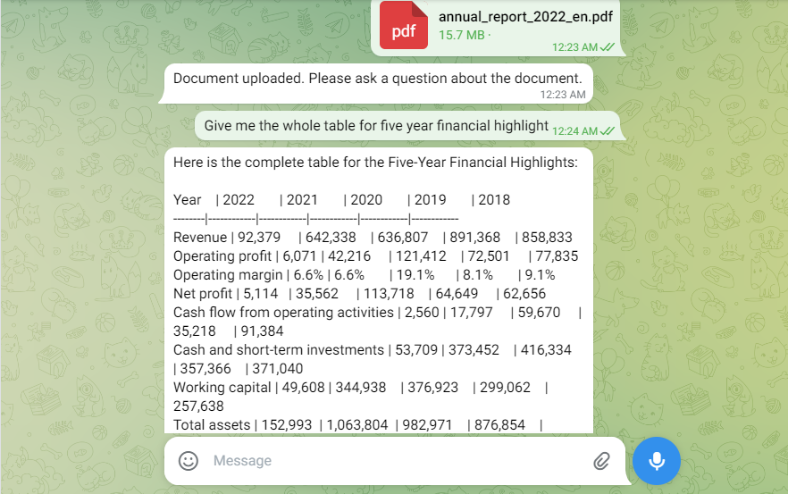

# Telegram AI Document Analyzer Bot

**Overview**

This Telegram bot is designed to analyze documents in various formats such as PDFs, DOCX, and TXT files. It uses the power of OpenAI's GPT (Generative Pre-trained Transformer) to provide intelligent responses.

## Getting Started

To use this bot, you'll need to follow these steps:

1. **Get the OpenAI Token**

   Obtain an OpenAI API token for the language model.

2. **Create a Telegram Bot**

   Create a new bot on Telegram using BotFather and obtain the bot token.

3. **Configure the Environment**

   Paste the OpenAI and Telegram bot tokens into the appropriate fields in the `.env` file.

4. **Activate the Environment**

   Run `pipenv shell` to activate the pipenv environment. The Pipfile already contains all the required dependencies.

5. **Set Environment Variables**

   Run the `config.py` file to ensure that all required environment variables are correctly set.

## Folder Structure

- **backend:** Contains `core.py`, where the `run_llm` function is defined.

- **config:** Holds `config.py`, where folder paths are defined. Make sure to update them as needed.

- **data:** Stores files sent by users through Telegram in the `data/output/` folder. It also creates local vector database indexes.

- **local_vector_store.py:** Responsible for creating a local vector store and generating embeddings.

- **main.py:** The main application file.

## Running the Bot

1. Run the following command:

   ```bash
   python3 main.py

2. Go to your Telegram bot and send  `/start` command to initiate the bot.
 
3. To analyze documents, specify that you want to analyze a document by using the keywords 'analyze' and 'document' in your message. 

4. Upload the document you want to analyze.

5. Ask any questions or queries you have regarding the document.

**Note: The bot will continue responding as long as the script is running.**



